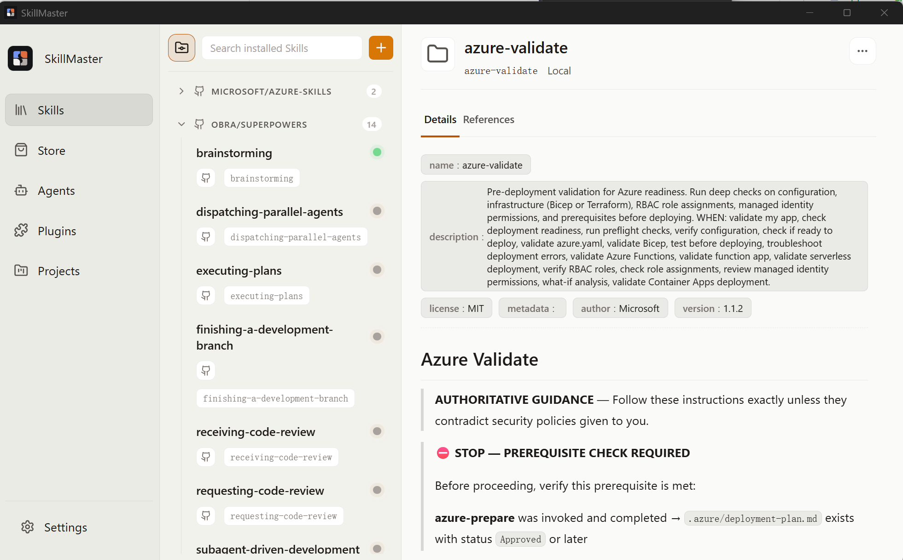
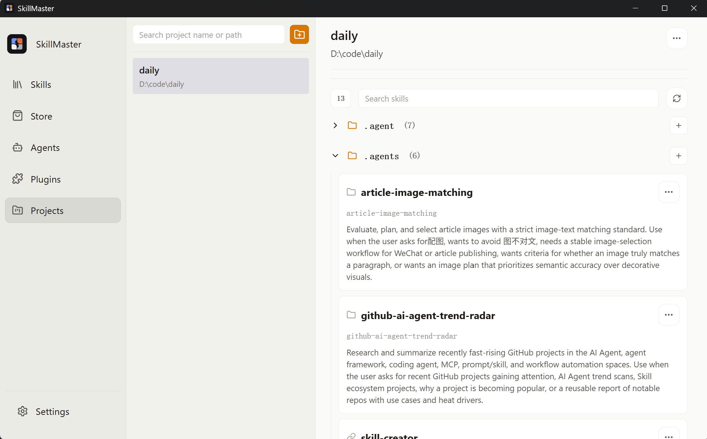
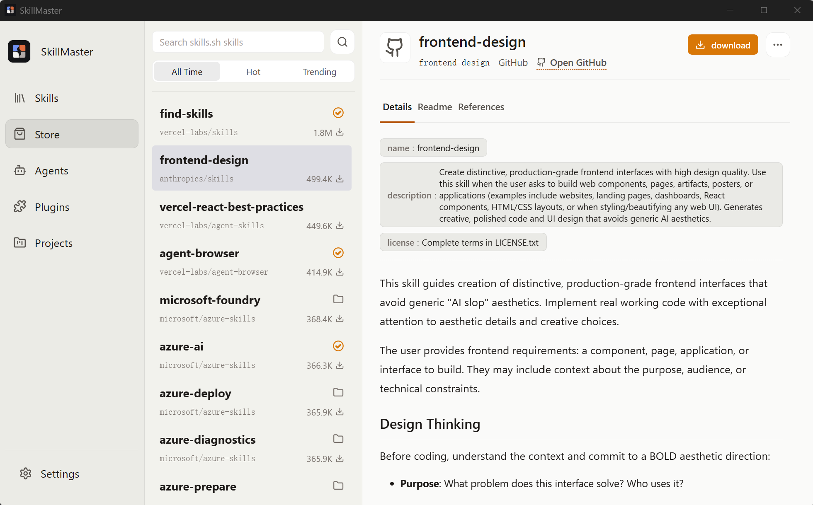
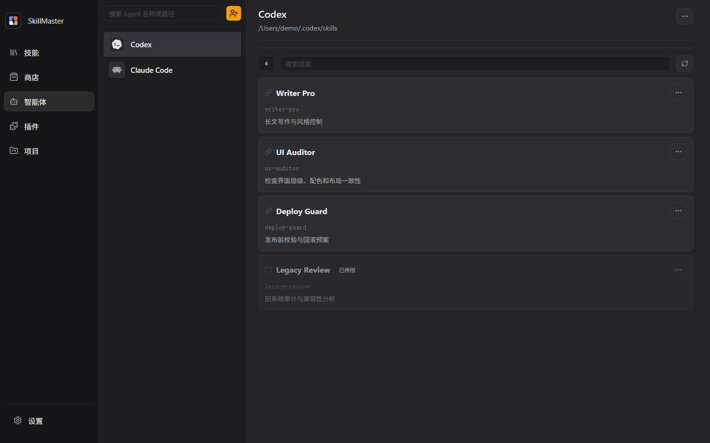
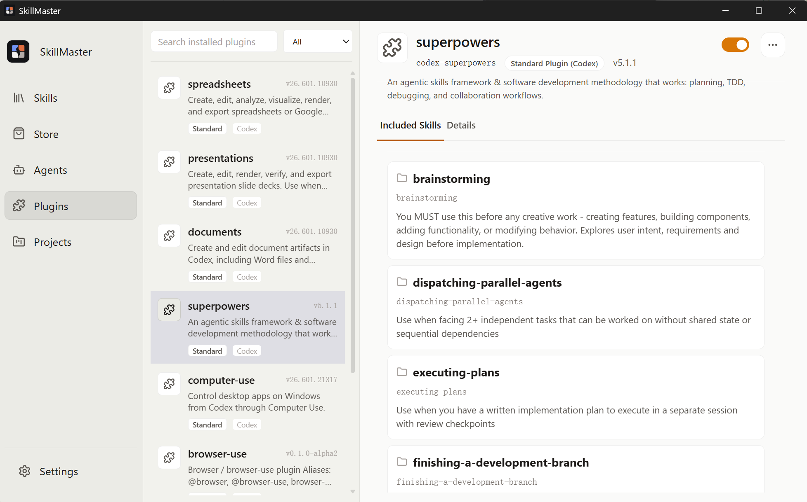
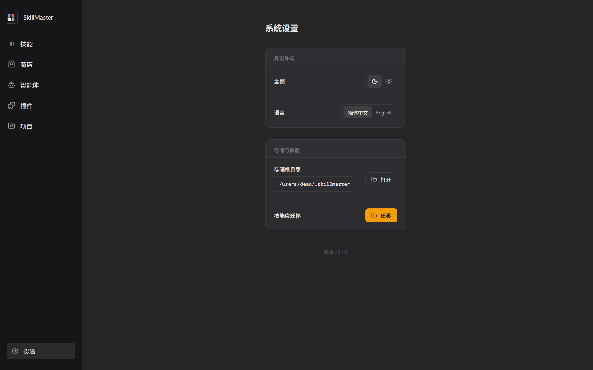

# SkillMaster

[English](README.md)

SkillMaster 是一个本地桌面应用，解决 agent skills 在日常使用中分散、重复、难同步的问题。它把散落在 Codex、Claude Code、项目目录和 GitHub 仓库里的 `SKILL.md` 统一收纳到本地技能库，并通过托管引用把同一份 skill 分发到需要它的 agent 或项目中。

当你频繁切换项目、试用不同 coding agent、从社区下载 skills，或需要在多个目录里保持规则一致时，SkillMaster 可以帮你完成导入、预览、关联、禁用和清理，避免手动复制目录、忘记同步版本或误删原始 skill。



## 功能介绍

- 集中收纳：把本地文件夹和 GitHub 仓库中的 skills 导入同一个技能库，预览 `SKILL.md` 和 README 后再决定是否使用。
- 一份多用：通过 SkillMaster 管理的引用，把同一份 skill 关联到用户目录、项目目录、自定义目录或不同 agent 的 skills 根目录。
- 项目规则：为每个项目设置 skill 的启用、禁用或继承状态，减少项目之间规则互相污染的问题。
- Agent 适配：维护 Codex、Claude Code 等 agent 的 skills 根目录，让不同工具共享同一套技能资产。
- 插件洞察：查看已安装插件包含的 skills、MCP 服务和支持的 agent，快速判断插件到底带来了什么能力。
- 商店发现：浏览 skills.sh 技能榜单，从商店条目进入下载和导入流程，减少手动查找与复制。
- 安全清理：删除前查看影响范围；移除引用时只清理托管链接，保留技能库中的原始 skill。
- 本地设置：切换主题和语言，查看存储路径，并在需要时迁移技能库。

## 截图

### 项目规则



### 技能商店



### 智能体目录



### 插件详情



### 系统设置



## 安装使用

### 1. 下载安装包

打开 [SkillMaster Releases 页面](https://github.com/zacktian89/ai-skill-master/releases)，下载适合当前系统的最新安装包。

每个 Release 会附带 Windows 安装包和 macOS 分发包。

macOS 版本未做签名和公证。首次启动时，请按住 Control 点击或右键点击应用，选择「打开」，再确认系统安全提示。

### 2. 安装并启动

运行下载的安装包，按系统提示完成安装，然后从开始菜单或桌面快捷方式启动 SkillMaster。

### 3. 导入 skill

1. 打开「技能」页面。
2. 点击新增按钮。
3. 选择本地包含 `SKILL.md` 的文件夹，或输入 GitHub 仓库地址。
4. 在预览列表中确认要导入的 skills。
5. 完成导入后，在详情页查看说明和引用状态。

### 4. 关联到 agent 或项目

1. 在「智能体」页面添加 agent 的 skills 根目录，或在「项目」页面添加项目目录。
2. 选择需要关联的 skill。
3. 使用「增加技能」或「新增引用」把 skill 链接到目标目录。
4. 后续删除引用时，SkillMaster 只移除托管引用，不会删除技能库中的原始 skill。

### 5. 调整项目规则

1. 打开「项目」页面。
2. 选择项目。
3. 为每个 skill 设置启用、禁用或继承默认规则。
4. 项目上下文会影响后续同步计算。

## 从源码运行

如果需要参与开发或在本地调试，可以使用源码方式运行。

### 1. 安装依赖

```powershell
npm install
```

### 2. 启动开发环境

```powershell
npm run dev       # 仅启动 Vite 浏览器预览
npm run build     # 类型检查并构建前端
npm test          # 运行前端测试
npm run tauri dev # 启动 Tauri 桌面开发环境
```

Rust 侧测试：

```powershell
Set-Location src-tauri
cargo test
Set-Location ..
```

构建安装包：

```powershell
npm run tauri build
```

## 技术栈

- Vue 3 + TypeScript
- Vite
- Tauri 2
- Rust
- Vitest

## 项目结构

```text
src/                 Vue 前端源码
src/api/             前端 API 封装和浏览器 mock 数据
src/components/      通用界面组件
src/views/           Skills、Store、Agents、Plugins、Projects、Settings 页面
src-tauri/           Tauri 与 Rust 后端命令
docs/                设计文档、验证记录和 README 截图
public/              图标和静态资源
```
